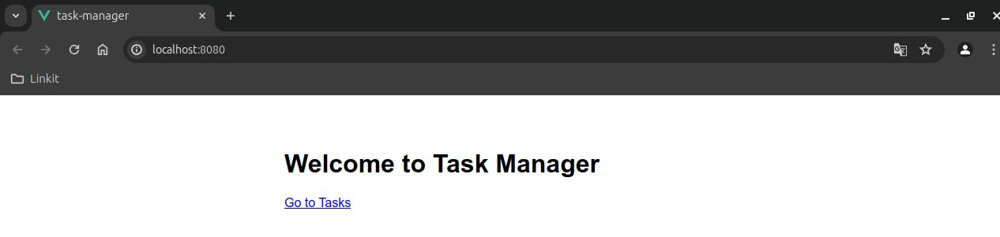
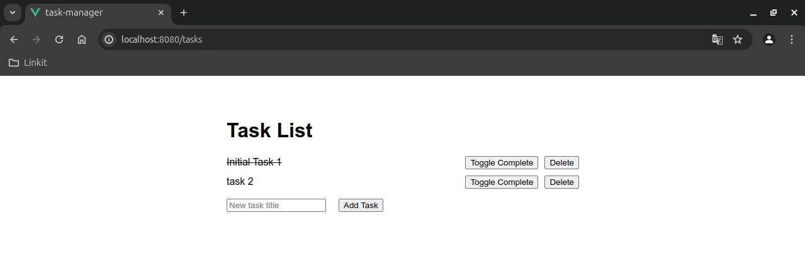

# Task Manager

A simple Vue.js application to manage a list of tasks. Users can add new tasks, toggle their completion status, and delete tasks.

## Features

- Add new tasks
- Toggle task completion status
- Delete tasks
- Project Structure

## Project Structure
```plaintext
.
├── public
│   ├── index.html
│   └── ...
├── src
│   ├── assets
│   ├── components
│   │   └── TaskList.vue
│   ├── App.vue
│   ├── main.js
│   └── ...
├── package.json
├── README.md
└── ...
```
## Getting Started

### Prerequisites
- Node.js
- npm (Node Package Manager) or yarn

## Installation
Clone the repository:
```sh
git clone https://github.com/yourusername/task-manager.git
cd task-manager
```
Install dependencies:
```sh
npm install
# or
yarn install
```

## Running the Application
```sh
npm run serve
# or
yarn serve
```
The application will be available at `http://localhost:8080`.




## Building for Production
```sh
npm run build
# or
yarn build
```
The production-ready files will be in the dist folder.

# Component Breakdown

**TaskList.vue**

This component handles the display and management of tasks.

**Data Properties**

- `newTaskTitle`: Holds the title of the new task to be added.
- `tasks`: An array of task objects. Each task has id, title, and completed properties.

**Methods**

- `submitTask`: Adds a new task to the tasks array.
- `toggleCompletion`: Toggles the completed status of a task.
- `removeTask`: Removes a task from the tasks array.

**Template**

Displays the task list, input field for new tasks, and buttons to toggle completion and delete tasks.

# Lints and fixes files
```
npm run lint
```

# Customize configuration
See [Configuration Reference](https://cli.vuejs.org/config/).
